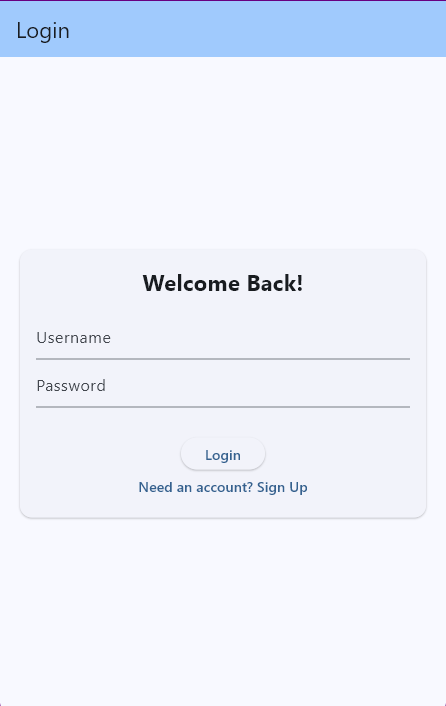
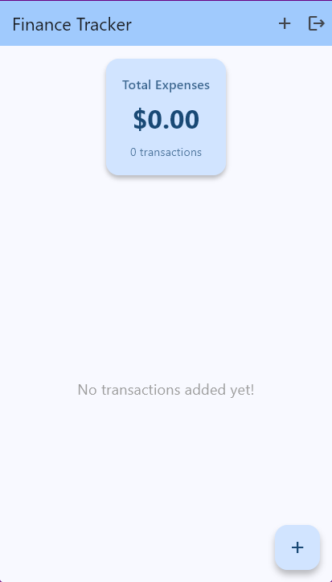
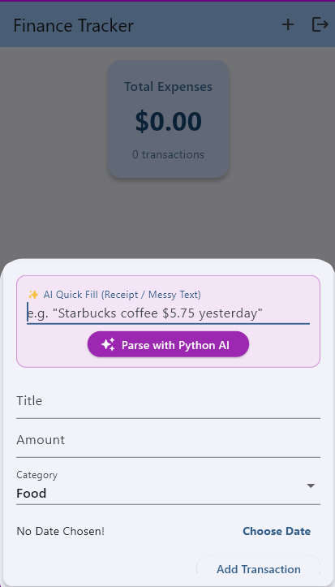
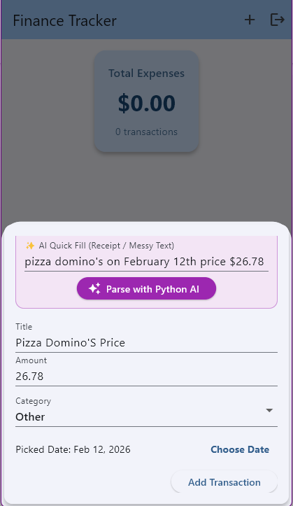
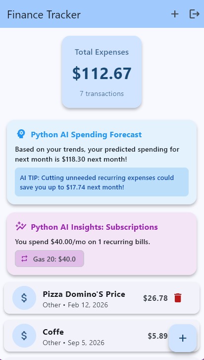
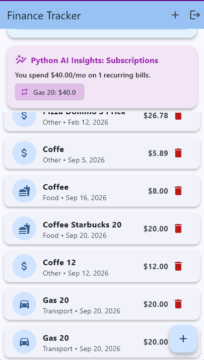

# 📊 Finance Tracker - Polyglot AI Personal Finance Platform

A full-stack, polyglot personal finance tracking application engineered with **Flutter** (Mobile/Desktop UI), a high-performance **Go** REST API server, a **Python** AI & analytics microservice, **Supabase PostgreSQL** cloud persistence, and **Docker** container orchestration.


---

## 📸 Screenshots

|                   Login                   |                     Home screen                      |                 Add Transaction                 |                  AI Parse                   |                 Example 1                 |                 Example 2                 |  
|:-----------------------------------------:|:----------------------------------------------------:|:-----------------------------------------------:|:-------------------------------------------:|:-----------------------------------------:|:-----------------------------------------:|
|  |  |  |  |  |  |

---

## 🧠 System Architecture

```
┌───────────────────────────────────────────────────────────────────────────┐
│                            FRONTEND (Flutter)                             │
│                                                                           │
│   [AuthScreen] ───> [Dashboard & SummaryCard] ───> [TransactionList]      │
│                             │                                             │
│                             ▼                                             │
│                      [ApiService]                                         │
└─────────────────────────────┬─────────────────────────────────────────────┘
                              │
                    HTTP / JSON Requests
          (POST /login, GET /transactions, etc.)
                              │
                              ▼
┌───────────────────────────────────────────────────────────────────────────┐
│                             BACKEND (Go)                                  │
│                                                                           │
│   [enableCORS Middleware] ───> [Route Handlers: /login, /transactions]    │
│                                             │                             │
│                                             ▼                             │
│                                      [database/sql]                       │
└─────────────────────────────┬───────────────────────────────┬─────────────┘
                              │                               │
                      Postgres CRUD Queries          Queries Database for AI
                       (INSERT, SELECT)                       │
                              │                               ▼
                              │            ┌────────────────────────────────┐
                              │            │   PYTHON ANALYTICS SERVICE     │
                              │            │           (Port 5000)          │
                              │            │                                │
                              │            │ - Recurring Expense Detector   │
                              │            │ - Next-Month Spending Forecast │
                              │            │ - Receipt NLP / AI Quick-Fill  │
                              │            └────────────────┬───────────────┘
                              │                             │
                              ▼                             ▼
┌───────────────────────────────────────────────────────────────────────────┐
│                       DATABASE (Supabase PostgreSQL)                      │
│                                                                           │
│                          db.supabase.co:5432                              │
└───────────────────────────────────────────────────────────────────────────┘
```

---

## ✨ Key Features

### 📱 **Flutter Frontend (Cross-Platform UI)**
- **Interactive Dashboard**: Total monthly expense summary card, transaction list, and formatted currency.
- **Expense Categories & Icons**: Support for Food 🍔, Rent 🏠, Transport 🚗, Entertainment 🎮, Shopping 🛍️, Bills 💡, and Other 💲 with matching category icons.
- **Pretty Date Formatting**: Integrated Flutter `intl` package (`DateFormat.yMMMd()`) for clean dates (e.g. `Sep 23, 2026`).
- **Auto-Login Session Persistence**: `SharedPreferences` saves your authenticated session locally so you stay logged in when re-opening the app.
- **✨ AI Smart Quick-Fill**: Paste messy text or receipt strings (e.g. `"Starbucks coffee $5.75 yesterday"`) to auto-fill title, amount, category, and date instantly.

### ⚡ **Go REST API Server (`:8080`)**
- **High-Performance Routing**: Built with Go `net/http` and CORS middleware.
- **Enterprise Security**: Cryptographic password hashing and salting with `golang.org/x/crypto/bcrypt`.
- **24/7 Cloud PostgreSQL Persistence**: Stores user accounts and transactions in Supabase Cloud Postgres using `github.com/lib/pq` driver.

### 🐍 **Python AI & Analytics Microservice (`:5000`)**
- **Flask REST Microservice**: Runs on port `5000` with `flask-cors`.
- **Recurring Subscription Detector**: Analyzes transaction history to identify recurring subscriptions (Netflix, Spotify, Rent, Gym) and calculate total monthly recurring costs.
- **Next-Month Spending Predictor**: Linear trend forecasting for next month's spending and AI saving recommendations.
- **NLP Receipt Parser**: Regular expression & natural language date parser handling explicit dates, relative days (`"yesterday"`, `"3 days ago"`), and ordinal day phrases (`"17th of the month"`, `"first of the month"`).

### ⏰ **24/7 Keep-Alive Automation**
- **Zero Cold Starts**: `cron-job.org` pings Go's `/api/health` every 15 minutes, automatically waking up the Python microservice so both servers stay 100% awake 24/7!

---

## 🛠️ API Reference

### **Go Backend (`http://localhost:8080/api`)**
| Method | Endpoint | Description |
| :--- | :--- | :--- |
| `GET` | `/health` | Server health check (Pings Python service) |
| `POST` | `/register` | User registration with `bcrypt` password hashing |
| `POST` | `/login` | User authentication |
| `GET` | `/transactions?userId=...` | Fetch user transactions from Supabase Postgres |
| `POST` | `/transactions` | Save new transaction to Supabase Postgres |
| `DELETE` | `/transactions?id=...` | Delete transaction from Supabase Postgres |

### **Python AI Microservice (`http://localhost:5000/api/analytics`)**
| Method | Endpoint | Description |
| :--- | :--- | :--- |
| `GET` | `/health` | Analytics service health check |
| `GET` | `/recurring?userId=...` | Detect recurring subscriptions & total monthly cost |
| `GET` | `/predict?userId=...` | Forecast next-month total spending & AI tips |
| `POST` | `/parse-receipt` | Parse raw receipt text or messy strings into structured transaction JSON |

---

## 🚀 Getting Started

### **Option 1: Launch with Docker Compose**
```bash
docker compose up --build
```
This launches the Go REST API on `localhost:8080` and the Python AI microservice on `localhost:5000` inside containers.

---

### **Option 2: Run Microservices Individually**

#### **1. Start Go Backend**:
```bash
cd backend
go run main.go
```

#### **2. Start Python AI Microservice**:
```bash
cd analytics
pip install -r requirements.txt
python app.py
```

#### **3. Start Flutter Frontend**:
```bash
flutter run
```

---

## 📦 Production Builds

- **Windows Desktop Executable (`.exe`)**:
  ```bash
  flutter build windows
  ```
- **Android App Bundle for Google Play (`.aab`)**:
  ```bash
  flutter build appbundle --release
  ```
- **Android APK Package (`.apk`)**:
  ```bash
  flutter build apk --release
  ```

---

## 📝 License

Distributed under the MIT License. See `LICENSE` for more information.
