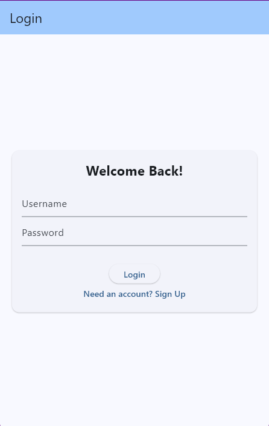
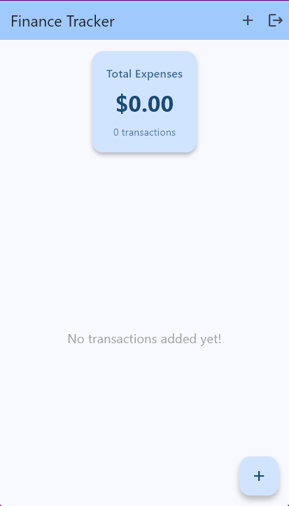
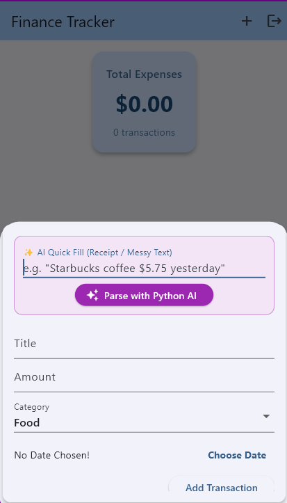
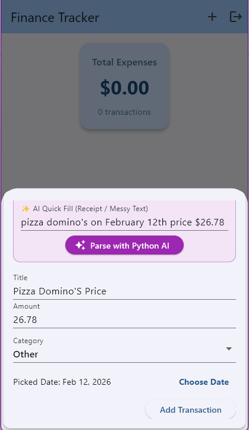
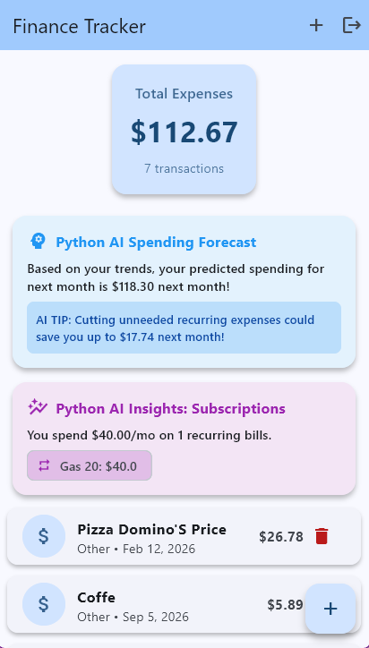
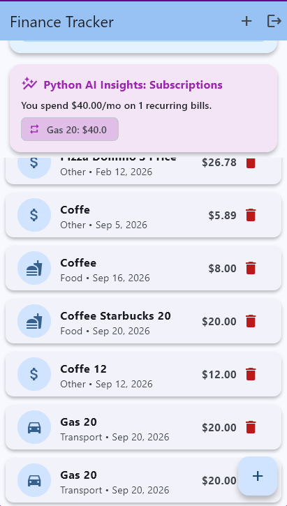

# 📊 Finance Tracker - Polyglot AI Personal Finance Platform

A full-stack, polyglot personal finance tracking application engineered with **Flutter** (Mobile/Desktop/Web UI), a high-performance **Go** REST API server, a **Python** AI & analytics microservice, **Supabase PostgreSQL** cloud persistence, and **Docker** container orchestration.

🌐 **Live Web Application**: **[https://JsamsIvyTech.github.io/Finance-Tracker/](https://JsamsIvyTech.github.io/Finance-Tracker/)**


---

## 🌐 Live Web App

The application is deployed live on **GitHub Pages**! You can open and use the application directly in any web browser without installing anything:

👉 **[https://JsamsIvyTech.github.io/Finance-Tracker/](https://JsamsIvyTech.github.io/Finance-Tracker/)**

---

## 📸 Screenshots

|                   Login                   |                     Home screen                      |                 Add Transaction                 |                  AI Parse                   |                 Example 1                 |                 Example 2                 |  
|:-----------------------------------------:|:----------------------------------------------------:|:-----------------------------------------------:|:-------------------------------------------:|:-----------------------------------------:|:-----------------------------------------:|
|  |  |  |  |  |  |

---

## 🧠 System Architecture

```
┌───────────────────────────────────────────────────────────────────────────┐
│                       FRONTEND (Flutter Mobile/Web)                       │
│                         https://JsamsIvyTech.github.io                    │
│                                                                           │
│   [AuthScreen] ───> [Dashboard & SummaryCard] ───> [TransactionList]      │
│                             │                                             │
│                             ▼                                             │
│                      [ApiService]                                         │
└─────────────────────────────┬─────────────────────────────────────────────┘
                              │
                    HTTP / JSON Requests
          (POST /login, GET /transactions, etc.)
                              │
                              ▼
┌───────────────────────────────────────────────────────────────────────────┐
│                             BACKEND (Go)                                  │
│                 https://finance-go-backend.onrender.com                   │
│                                                                           │
│   [enableCORS Middleware] ───> [Route Handlers: /login, /transactions]    │
│                                             │                             │
│                                             ▼                             │
│                                      [database/sql]                       │
└─────────────────────────────┬───────────────────────────────┬─────────────┘
                              │                               │
                      Postgres CRUD Queries          Queries Database for AI
                       (INSERT, SELECT)                       │
                              │                               ▼
                              │            ┌────────────────────────────────┐
                              │            │   PYTHON ANALYTICS SERVICE     │
                              │            │           (Port 5000)          │
                              │            │                                │
                              │            │ - Recurring Expense Detector   │
                              │            │ - Next-Month Spending Forecast │
                              │            │ - Receipt NLP / AI Quick-Fill  │
                              │            └────────────────┬───────────────┘
                              │                             │
                              ▼                             ▼
┌───────────────────────────────────────────────────────────────────────────┐
│                       DATABASE (Supabase PostgreSQL)                      │
│                                                                           │
│                          db.supabase.co:5432                              │
└───────────────────────────────────────────────────────────────────────────┘
```

---

## ✨ Key Features

### 📱 **Flutter Frontend (Cross-Platform UI)**
- **Live Web & Mobile**: Deployed live on GitHub Pages, Android (`.aab` v14), and Windows Desktop (`firstapp.exe`).
- **💰 Monthly Income & Net Remaining Budget Card**: Displays Earned Income vs. Total Expenses, highlighting your Net Remaining Budget (Green if positive, Red if over budget!).
- **Expense vs. Income Segmented Toggle**: Easily log paychecks, side gigs, or gifts as **Income** alongside **Expenses**.
- **Dedicated Income & Expense Categories**: Support for Salary 💼, Gifts 🎁, Side Gigs 🚀, Investments 📈 alongside Food 🍔, Rent 🏠, Transport 🚗, Entertainment 🎮, Shopping 🛍️, and Bills 💡.
- **Pretty Date Formatting**: Integrated Flutter `intl` package (`DateFormat.yMMMd()`) for clean dates (e.g. `Sep 23, 2026`).
- **Auto-Login Session Persistence**: `SharedPreferences` saves your authenticated session locally so you stay logged in when re-opening the app.
- **✨ AI Smart Quick-Fill**: Paste messy text or receipt strings (e.g. `"Starbucks coffee $5.75 yesterday"`) to auto-fill title, amount, category, and date instantly.

### ⚡ **Go REST API Server (`:8080`)**
- **High-Performance Routing**: Built with Go `net/http` and CORS middleware.
- **Enterprise Security**: Cryptographic password hashing and salting with `golang.org/x/crypto/bcrypt`.
- **24/7 Cloud PostgreSQL Persistence**: Stores user accounts and transactions in Supabase Cloud Postgres using `github.com/lib/pq` driver with connection pooling.

### 🐍 **Python AI & Analytics Microservice (`:5000`)**
- **Flask REST Microservice**: Runs on port `5000` with `flask-cors`.
- **Recurring Subscription Detector**: Analyzes transaction history to identify recurring subscriptions (Netflix, Spotify, Rent, Gym) and calculate total monthly recurring costs.
- **Next-Month Spending Predictor**: Linear trend forecasting for next month's spending and AI saving recommendations.
- **NLP Receipt Parser**: Regular expression & natural language date parser handling explicit dates, relative days (`"yesterday"`, `"3 days ago"`), and ordinal day phrases (`"17th of the month"`, `"first of the month"`).

### ⏰ **24/7 Keep-Alive Automation**
- **Zero Cold Starts**: `cron-job.org` pings both the Go backend (`:8080`) and Python AI microservice (`:5000`) every **5 minutes**, ensuring both microservices stay 100% awake 24/7 with zero cold starts!

---

## 🛠️ API Reference

### **Go Backend (`https://finance-go-backend.onrender.com/api`)**
| Method | Endpoint | Description |
| :--- | :--- | :--- |
| `GET` | `/health` | Server health check (Pings Python service) |
| `POST` | `/register` | User registration with `bcrypt` password hashing |
| `POST` | `/login` | User authentication |
| `GET` | `/transactions?userId=...` | Fetch user transactions from Supabase Postgres |
| `POST` | `/transactions` | Save new transaction to Supabase Postgres (Supports `isIncome`) |
| `DELETE` | `/transactions?id=...` | Delete transaction from Supabase Postgres |

### **Python AI Microservice (`https://finance-python-analytics.onrender.com/api/analytics`)**
| Method | Endpoint | Description |
| :--- | :--- | :--- |
| `GET` | `/health` | Analytics service health check |
| `GET` | `/recurring?userId=...` | Detect recurring subscriptions & total monthly cost |
| `GET` | `/predict?userId=...` | Forecast next-month total spending & AI tips |
| `POST` | `/parse-receipt` | Parse raw receipt text or messy strings into structured transaction JSON |

---

## 🚀 Getting Started

### **Option 1: Open Live Web App (Instant)**
Open **[https://JsamsIvyTech.github.io/Finance-Tracker/](https://JsamsIvyTech.github.io/Finance-Tracker/)** in any browser!

---

### **Option 2: Launch Locally with Docker Compose**
```bash
docker compose up --build
```
This launches the Go REST API on `localhost:8080` and the Python AI microservice on `localhost:5000` inside containers.

---

## 📦 Production Release Builds

- **Web Live Application**: Hosted on GitHub Pages at `https://JsamsIvyTech.github.io/Finance-Tracker/`.
- **Windows Desktop Executable (`.exe`)**: Compiled Flutter desktop bundle (`flutter build windows`).
- **Android App Bundle for Google Play (`.aab`)**: Signed release bundle v14 (`flutter build appbundle --release`).
- **Android APK Package (`.apk`)**: Standalone Android package (`flutter build apk --release`).

---

## 📝 License

Distributed under the MIT License. See `LICENSE` for more information.
